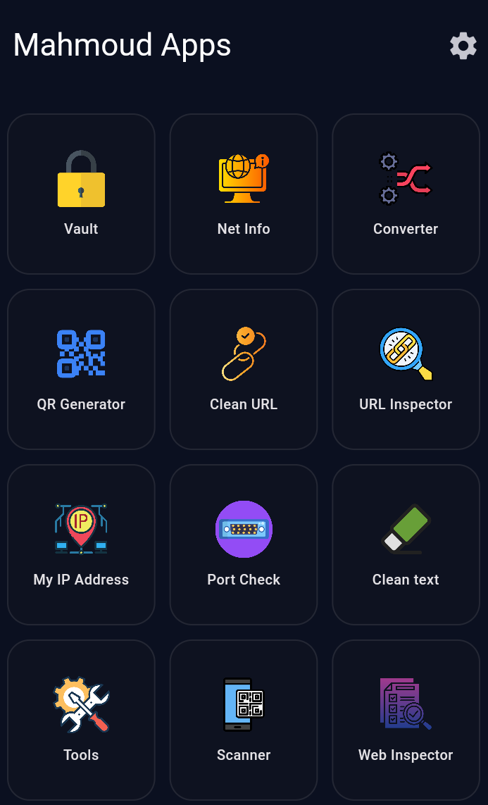
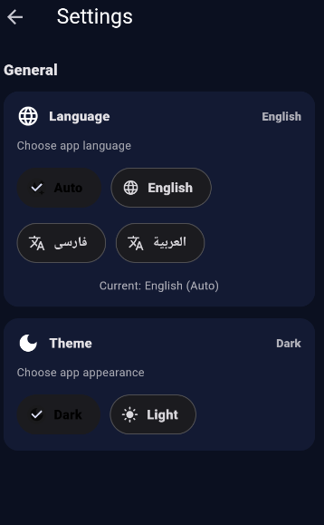
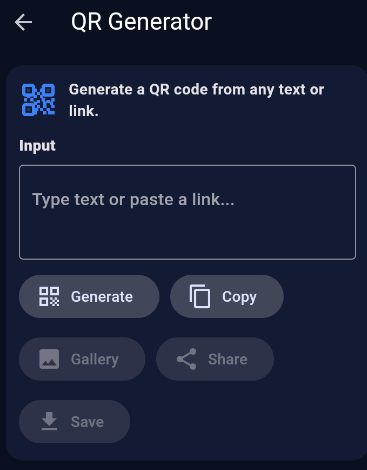
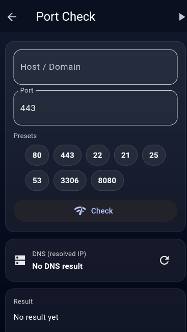
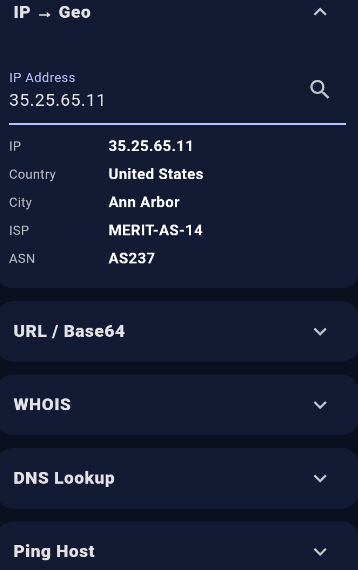
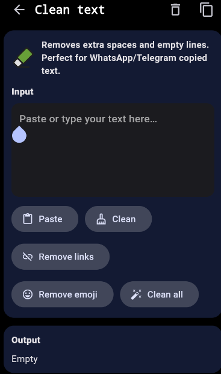
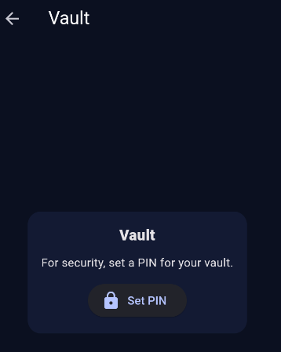

# Mahmoud Apps

A multi-platform Flutter application built for **Android, iOS, Web, Windows, and macOS**.

---

## 🇬🇧 English

### ✨ Features
- Supports Android / iOS / Web / Windows / macOS  
- Clean and simple UI  
- Built with Flutter & Dart  
- Open-source project hosted on GitHub  

### 🧱 Tech Stack
- Flutter  
- Dart  

---

## 🇮🇷 فارسی

### ✨ امکانات
این پروژه یک اپلیکیشن Flutter چندسکویی است که برای پلتفرم‌های زیر توسعه داده شده است:

- Android / iOS / Web / Windows / macOS  
- رابط کاربری ساده و تمیز  
- توسعه داده شده با Flutter و Dart  
- پروژه متن‌باز منتشر شده در GitHub  

### 🧱 تکنولوژی‌ها
- Flutter  
- Dart  

---
🇮🇷 **فارسی**  
این اپلیکیشن یک مجموعه از ابزارهای کاربردی است که برای استفاده در موبایل طراحی و توسعه داده شده است.  
پروژه در حال حاضر در مرحله‌ی توسعه فعال قرار دارد و امکانات جدید به‌صورت تدریجی به آن اضافه خواهند شد.  
هدف این پروژه ارائه ابزارهای ساده، سریع و قابل‌اعتماد در قالب یک اپلیکیشن یکپارچه است.

🇬🇧 **English**  
This application is a collection of practical tools designed and developed for mobile use.  
The project is currently under active development, and new features will be added progressively.  
The goal of this project is to provide simple, fast, and reliable tools within a unified application.

## 📸 Screenshots | اسکرین‌شات‌ها

  

  

  

  

  

  

  

  

  

  

  

